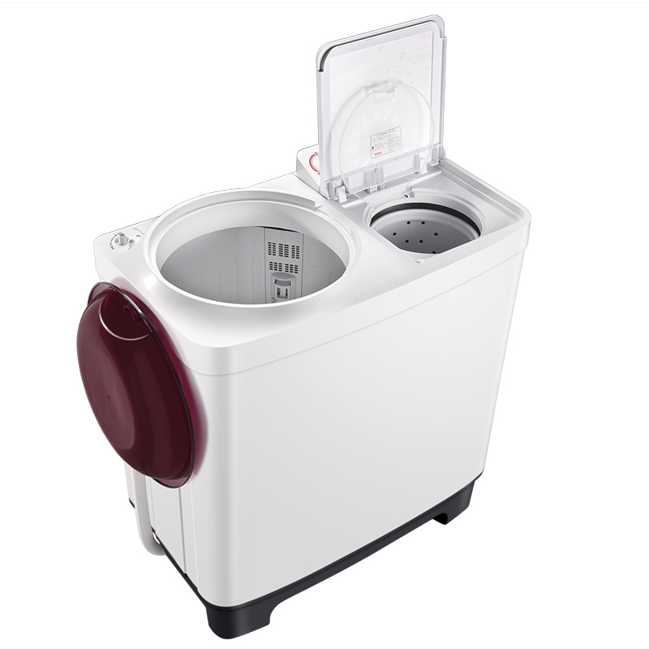
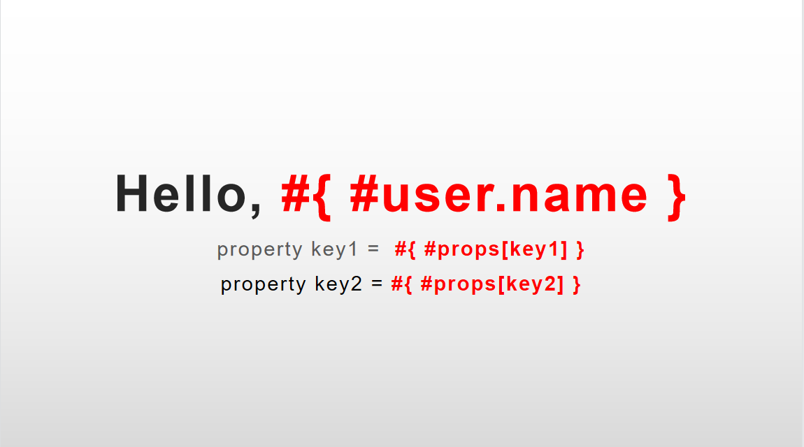
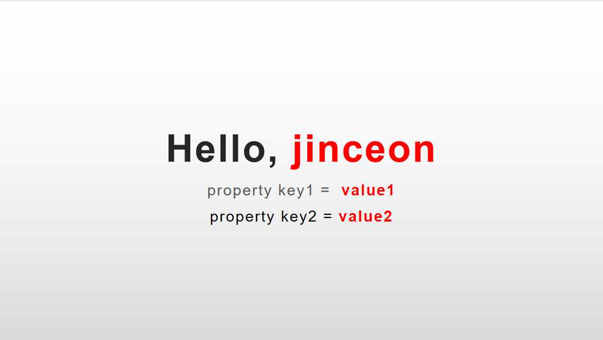

# simple-ppt-engine 简便PPT引擎
named it `simple-ppt-engine` doesnot mean itself is a simple engine,
but hope the way you use it is simple.  
之所以取名“简便PPT引擎”，不是想说它本身很简单，而是希望你使用它的方式非常简便。

## 创作背景
部门有很多定期的汇报，月报甚至周报，PPT是固定模板，每周（月）固定取数填充。   
一开始团队里的成员是写了一个工具类，里面包含一大堆工具方法，如replaceText(shape, map)（思路大概就是ppt模板里用${abc}设置一个占位符，然后从map里取abc来替换掉ppt模板里的文本）。   
还记得那时我在周四评审会上，特意吐槽了下程序员思考不够深，只会做一些很肤浅很表面的工具类封装，没有产品思维。   
那时我用洗衣机来举例。没有洗衣机的时候，大家手洗衣服，把衣服不停地揉搓，然后把衣服拧干。   
自然而然就有聪明人想着发明一些工具。于是就有了双缸（半自动）洗衣机。   
双缸洗衣机有2个缸，洗衣服的时候，先把衣服扔到左边的洗衣缸，洗衣机搅拌一段时间后，需要手动将衣服捞出后转移到右侧的脱水缸。脱水完成后再手动将衣服扔回洗衣缸搅拌漂洗，然后再手动捞出到脱衣缸甩干。   
虽然双缸半自动洗衣机确实已经帮助我们省了很多力气，但不可否认，它是一个很呆的设计。  
然后，全自动洗衣机横空出世了。  
我们只需要把脏衣服扔进去洗衣机，启动，就完事了。我们只需要等待，等待它洗完。   



说到这里，大家有没有发现，我们平时写的一大堆工具类，其实就是半自动的洗衣机。  
你光想着把这一个工序（步骤）用工具自动代替你人工，这确实是进步，但也就仅此而已。  
**关注目标，而不是关注现状**。   
我们的目标是把衣服洗干净，我们需要的是一个把衣服洗干净的东西，而不是一个帮我们自动搅拌揉搓衣服的工具+一个自动把水分从衣服甩干的工具。
当然也有人会反驳我，设计也不是一蹴而就的，而是慢慢迭代演进升级的。  
为什么不是一开始就发明全自动洗衣机？存在即合理。   
嗯，合理。我接着说，那要怎样从工具思维升级到产品思维呢？   
**归零思维**。  
从洗衣缸捞到脱衣缸，再捞回洗衣缸，这些依然是重复性的工作，非要人的参与吗？
把这些人的参与的工序想办法都给自动化了，消灭掉这些工具。于是就有了最终的产品---全自动洗衣机。   

我们写代码也是如此。比如这个PptUtil，其实我们一开始的目标就是将变量替换掉PPT模板里的占位符而已，非得让程序员手动调用PptUtil里的一大堆方法吗？   
现在不是各种MVC、MVVM的设计思想吗？能不能让程序员专注数据，产品经理专注模板（UI）？
能不能实现一个很牛逼的引擎，一行代码就搞定将变量渲染到模板？   
```java
   engine.render(pptFile, data); // 最开始的设想
```
当时我是提了这个设想，我的团队小伙伴也实现了一版。   
但是我觉得实现的不优雅（~~后续会更新说明，两种设计~~参见[创建背景](./docs/background.md)）。   
想着我不能光BB，于是，就有了本项目。

## Notice 注意
不考虑ppt格式，仅支持pptx（未来也不会考虑支持ppt）
## quick-start 快速起步
### step-1 Prepare a template 准备PPT模板


### step-2 Add Dependency into Pom.xml 在Pom.xml引入依赖
```xml
<dependency>
    <groupId>io.gitee.jinceon</groupId>
    <artifactId>simple-ppt-engine</artifactId>
    <version>1.0.0</version>
</dependency>
```

### Prepare data and code 准备数据和代码
```java
import io.gitee.jinceon.core.DataSource;

import java.util.HashMap;

public class HelloPPT {
    public static void main(String[] args) {

        // 1. create engine instance 创建引擎
        SimpleEngine engine = new SimpleEngine("hello-ppt.pptx");

        // 2. add data to dataSource 填充数据
        DataSource dataSource = new DataSource();
        User user = new User("jinceon");
        Map props = new HashMap();
        props.put("key1", "value1");
        props.put("key2", "value2");
        dataSource.setVariable("user", user);
        dataSource.setVariable("props", props);
        engine.setDataSource(dataSource);

        // 3. render data to template 将数据渲染到模板上
        engine.process();
        
        // 4. save result
        engine.save("hello-ppt-renderd.pptx");
    }
}
```
### Screen SnapShot


## Design Introduction 设计思路
[Introduction](docs/INTRODUCTION.md)

## Data和UI绑定
[Data和UI绑定](docs/BindData.md);

## ShowCase 功能演示
### Text Style 文本样式
the style will be unchanged after replacing data to variables.   
变量替换成数据后，会保留渲染前变量的样式。

[Text Documentation](docs/processor/Text.md)
### Table 表格
easily render a collection (such as List) to a Table.  
便捷地将一个集合（如List）填充到表格上。

[Table Documentation](docs/processor/Table.md)

### Chart 图表
in fact we don't care about which kind of chart you actually use, 
we just manipulate the data table nested in the shape.  
事实上我们不关心你用的是饼图、直方图还是什么别的，我们只操作内置在PPT里的表格数据。

[Chart Documentation](docs/processor/Chart.md)

### If 指令
[if指令](docs/directive/if.md)

### For 指令
[for指令](docs/directive/for.md)

### Define your own Processor 自定义处理器
1. let your class implements an interface. 自定义处理器实现3个接口中的一个。
    > DataProcessor, ShapeProcessor, SlideProcessor
2. set an order use `@Order`. 配合`@Order`合理设置处理顺序。
3. use `addProcess()` to add your processor into engine's processors list. 加入到引擎的处理器列表。

## RoadMap 产品蓝图
- [ ] [dynamic style 动态样式](docs/roadmap/dynamic-style.md)
- [x] apache poi implementation 用开源的apache poi替换掉商业闭源的aspose

## Todo 待办
- unit test and coverage 单元测试及代码覆盖率（[关于单元测试和TDD](docs/tdd.md)）

## FAQ 常见问题
[常见问题](docs/faq.md)