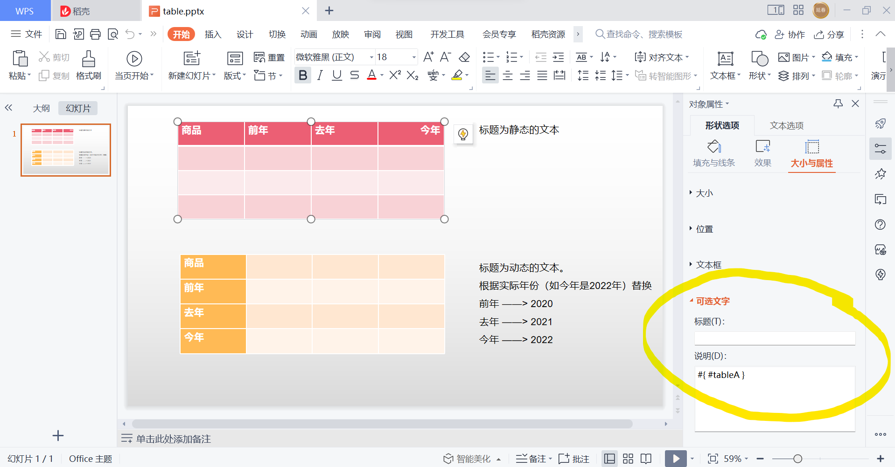
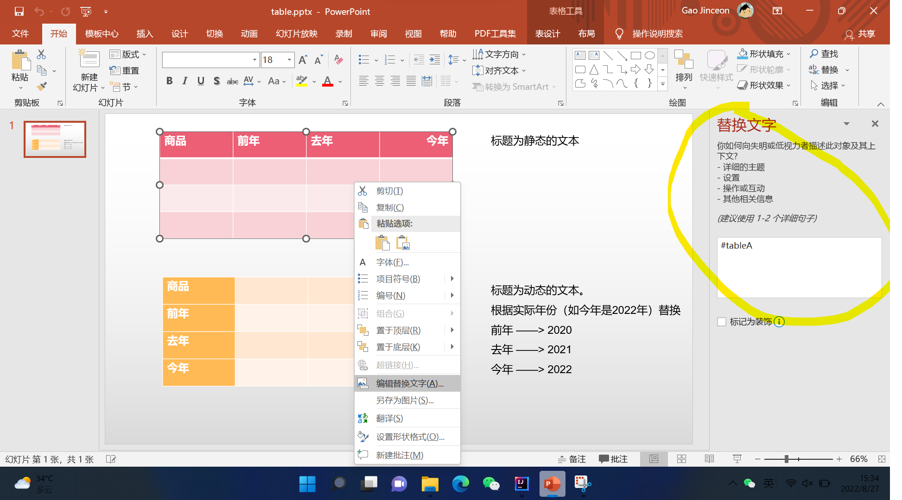

# Data和UI绑定
除了Text文本是直接在文本框设置占位符外，其他的复杂形状如表格、图标等，都需要显式绑定UI和Data。

和文本框一样，引擎使用SpEL（Spring Expression Language）来设置数据源。  
比如一个表格，需要将其指向一个名为`tableA`的数据源，可以使用`#{ #tableA }`。

```java
DataSource dataSource = new DataSource();
Table table = new Table(new Object[3][4]);
dataSource.setVariable("tableA", table);
engine.setDataSource(dataSource);
```

## 设置方法
### wps
鼠标选中形状，右侧边栏会出现`对象属性`面板。  
在`形状选项`→`大小与属性`→`可选文字`→`说明`里设置。  
在wps里，可选文字分为`标题`和`说明`。  
但是在powerpoint里，没有`标题`。为了通用兼容，务必将表达式设置在`说明`里。

### powerpoint
对着形状右键，点击菜单`编辑替换文字`，右侧边栏会出现`替换文字`面板。  
在文本框里设置表达式即可。
