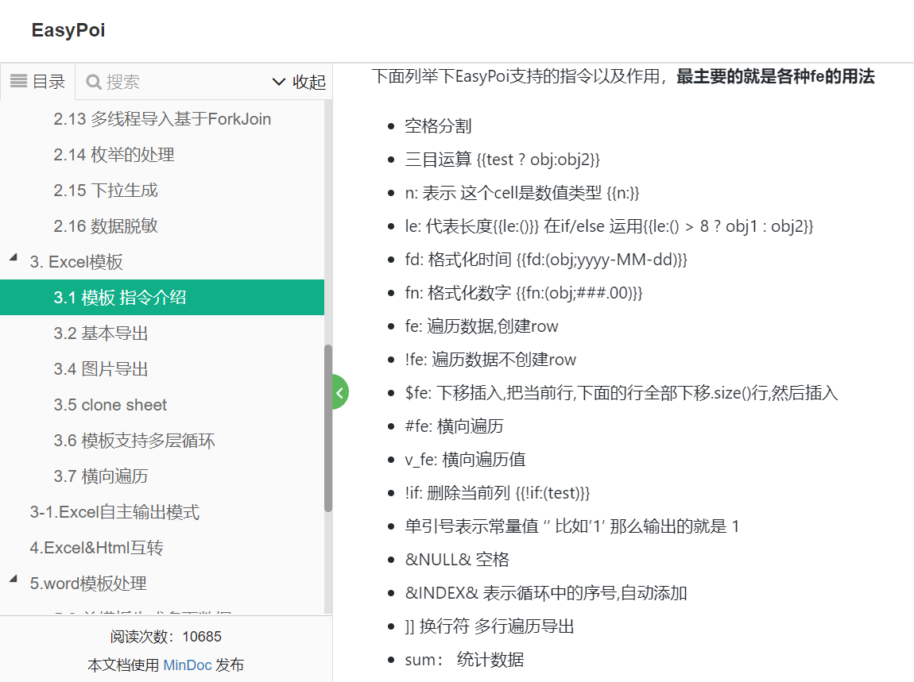
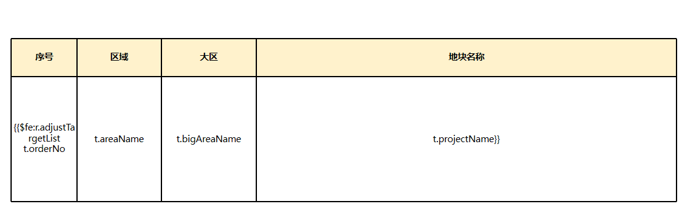

# 创作背景
部门有很多定期的汇报，月报甚至周报，PPT是固定模板，每周（月）固定取数填充。   

## 发展历程
### 原始版本1.0
一开始团队里的成员是写了一个工具类，里面包含一大堆工具方法，如findShapeById、replaceText(shape, map)（思路大概就是ppt模板里用${abc}设置一个占位符，然后从map里取abc来替换掉ppt模板里的文本）、replaceChart、replaceTable等。  
至于使用，也是毫无设计可言，就是纯粹的面向过程式编程。  
比如1个10页的PPT，那么写一堆的Java过程式变量替换。
```java
public void renderWeeklyReport(){
    renderPage1();
    renderPage2();
    ...
}

private void renderPage1(){
    // ... 从数据库或其他数据源获取数据
    Map map = retrieveDataFromDataBase();    
    for(Shape shape: getPage(1).getShapes()){
        replaceText(shape, map);
    }
}
```
显然如上的代码有非常多的问题。  
1. 写死了页码，一旦PPT内容发生变化如插入几页PPT或删除几页PPT，代码中的页码都得改。
2. 后来出现了动态分页等需求，比如需要把项目列表展示处理，每页PPT展示20条， 超过则分页，由于项目数量的不确定导致分页数量就不确定，于是遍历每一页PPT里的每个形状了。
3. 以页为单位的过程式编程，导致了变量、结果无法复用，出现大量的重复的形状遍历

### 改进版本2.0
当时我提出了一个原则：**UI和逻辑分离**

怎么能把业务的取数逻辑和渲染放在一块呢？  

渲染PPT应该是一个纯粹的UI行为，和数据输出为json格式、html格式、pdf格式是一个层级的。  
所以UI渲染这款(PPT渲染)完全可以单独做个服务，后端专注于业务（取数逻辑），然后将数据发给渲染服务，渲染服务专注于PPT处理。  

当时给小伙伴定了这么个接口，2个参数分别是ppt模板、需要用到的所有数据data。
```java
   engine.render(pptFile, data); // 最开始的设想
```
小伙伴也实现了一般，但是实现的方式我非常不满意。尤其是表格的表达式这块。  
他借鉴了easypoi的表达式语法，让我觉得有点复杂，学习、使用成本高。

最严重的地方是，他没把表格当成一个整体处理，而是遍历表格里的每一个单元格来处理。  

如上图，第1个问题是指令不直观，如`$fe`表示下移插入，`{{`和`}}`则是用来限制表格起始的。  
第2个问题是致命的，需要将业务变量显式地写在模板里。但是显然模板是产品经理给的，放到具体的行业、公司、团队里，产品经理不一定懂技术，不一定知道具体的变量名是什么。  
产品经理给的原始模板大概率写的是他的期望（渲染后的结果），程序员要把动态的部分替换成变量名，一旦后续模板发生变化，产品经理给个新的模板过来很容易发生2个模板的同步问题。
但如果让产品经理在程序员替换好变量的这个模板上改的话，对产品经理又不友好。

## 当前版本3.0
在使用层面有2个变化。  
一是放弃easypoi的指令，拥抱spel，使用广泛，门槛低简单易学，功能也十分强大。  
二是将表格等复杂对象当成一个整体来考虑，处理表格的时候，不再关注具体的单元格（参见[Table](./processor/Table.md)）。