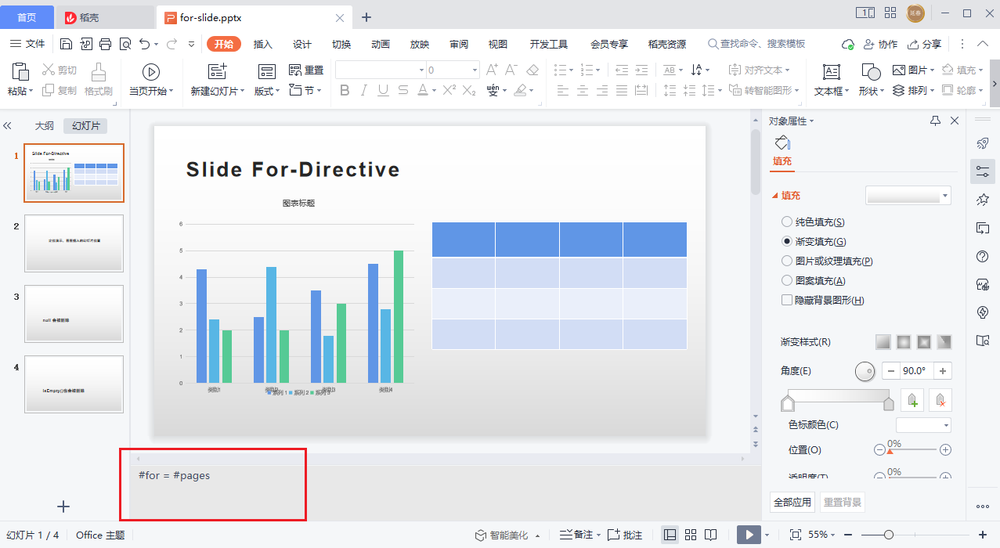

# for directive ( for 指令)
## 格式
```text
#for = #variable
```
例如
```text
#for = #users
```
## Slide 幻灯片
针对幻灯片，可以在`备注`里添加for指令。  
当`expression`执行为`true`时，幻灯片保留；为`false`时幻灯片删除。  

## Shape 形状(目前只支持Table 表格)
可以在`可选文本`里添加for指令，让表格实现自动伸缩。    
假设模板UI上的表格大小是`4 * 4`。  
当传入的表格数据是 `5 * 5` 时，UI会自动扩展（引擎默认取最后一行、最后一列为模板复制）。  
当传入的表格数据是 `3 * 3` 时，UI会自动裁剪（引擎默认从最后一行、最后一列开始删除）。


## 设计思路
关于分页，相信大家都不会陌生。几乎所有的列表型UI都会需要考虑分页的设计。  
一开始我也是走了寻常的俗套路线，实现一个table指令（类似 table={ data=users, pagesize=10, deleteWhenEmpty=true }等。  
deleteWhenEmpty=true是如果数据列表为空，要不要把整个表格删除的意思。  
但当时还考虑了很多情况，比如表格自动分页，这一个ppt上只有表格吗？  
有没有一些标题或其他文字描述甚至图表？
复制的话只复制表格吗？表格位置摆放？

如上图，如果幻灯片有多个元素，表格有几十条数据需要分页，分出来的页是只包含表格吗？

而且，如果为一个表格设计这么多配置参数，以后还有图表，还有文本，还有图片，扩展一大堆的配置参数，开发成本会很高，用户使用成本也会很高。  
但指令的配置项少的话又会显得功能很简陋、粗糙。  
当时纠结了很久，天天想着抽象，抽象，到底该怎样抽象？  
有一次突然灵光一闪，与其去为每个元素设计配置参数，不如继续抽象一些通用配置。  
几乎所有的编程语言在做语法结构设计的时候，绕不开的2个关键逻辑：if和for。  
我的设计，能不能也做到，仅用if和for即可实现分页、删除（列表为空时）？  

最终采用的方案是从幻灯片复制入手。
如果有40条数据，每个表格放10行，那么需要4个表格。每页ppt放一个表格的话，需要4页ppt。
在【幻灯片】上用for标签循环复制出4页幻灯片，然后每个幻灯片的表格上用for标签动态渲染。