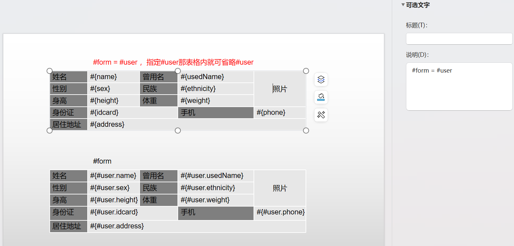

# form directive ( form 指令)
## 格式
```text
#form = expression
```
例如
```text
#form = #user
#form
```
## 使用场景
ppt里只有table，但我们偶尔需要用table来实现表单form。  

例如上图这种表单用table来渲染会是很麻烦的事。  

所以像text一样用占位符代替会是一个更好的方案。  

注意，如果`可选文字`里只写`#form`指令，那么占位符须写完整的路径，如`#{ #user.name }`；  
如果`可选文字`里指明了引用对象如`#form = #user`，那么占位符可以省略`#user.`直接写 `#{ name }`

## Example 示例
```java
SimpleEngine engine = new SimpleEngine("src/test/resources/form.pptx");
DataSource dataSource = new DataSource();

User user = new User();
user.setName("张山");
user.setUsedName("张三");
user.setSex("男");
user.setEthnicity("汉族");
user.setWeight("65kg");
user.setHeight("179cm");
user.setIdcard("440223200001011234");
user.setPhone("15012341234");
user.setAddress("广东省广州市天河区天河公园");
dataSource.setVariable("user", user);

engine.setDataSource(dataSource);
engine.process();
String outputfile = "src/test/resources/test-form.pptx";
engine.save(outputfile);
```
## 定制化函数钩子
表单是个非常常用的组件。  
有时也会有一些定制化需求，比如说同一个字段，不同值时用不同样式。  
这在模板上是不好设置的。  
因此增加了一个定制化函数钩子，可以在里面实现一些风格的定制化。  
具体代码可以参见`src/test/java/io/gitee/jinceon/core/data/FormDataProcessorHookTest.java`

```java
SimpleEngine engine = new SimpleEngine("src/test/resources/form-hook.pptx");
DataSource dataSource = new DataSource();

//map不能简写，必须写全spel路径
Map<String, Object> user = new HashMap<>();
user.put("name", "张山");
user.put("usedName",new FormItem("张三", cell -> {
    cell.setFillColor(Color.RED);
}));
dataSource.setVariable("user", user);


User user1 = new User();
user1.setName("李四");
user1.setUsedName(new FormItem("李斯", cell -> {
    cell.setFillColor(Color.RED);
}));
dataSource.setVariable("user1", user1);

engine.setDataSource(dataSource);
engine.process();
String outputfile = "src/test/resources/test-form-hook.pptx";
engine.save(outputfile);
```


