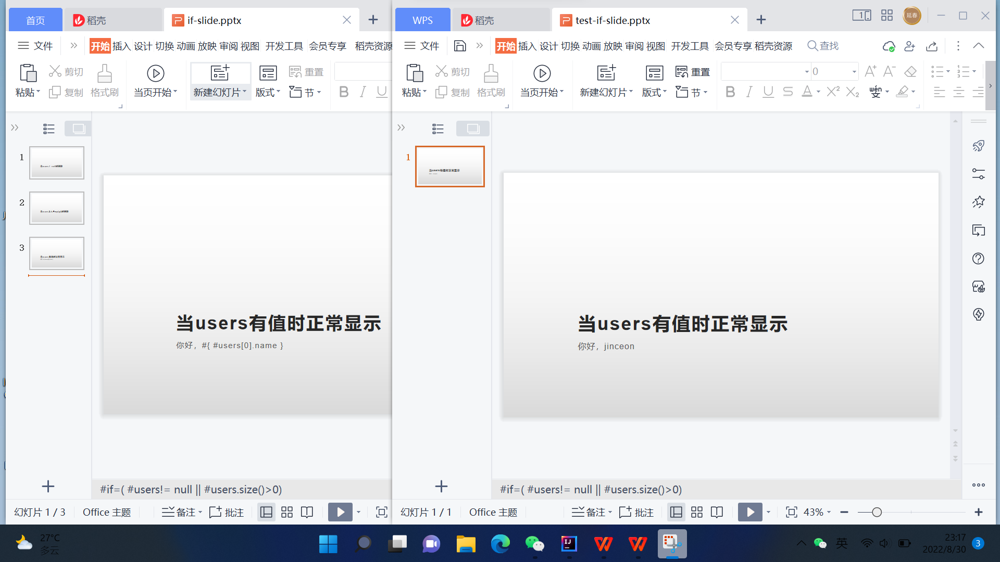
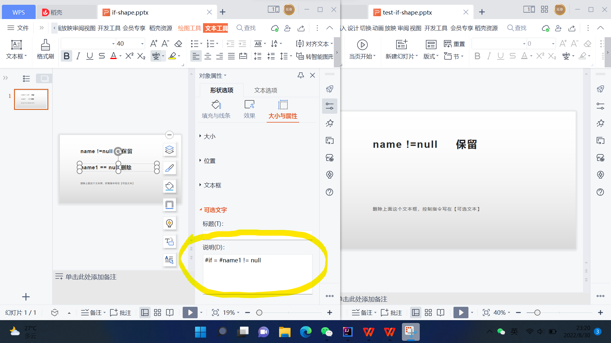

# if directive ( if 指令)
## 格式
```text
#if = expression
```
例如
```text
#if = (#user != null && #user.size > 0)
```
## Slide 幻灯片
针对幻灯片，可以在`备注`里添加if指令。  
当`expression`执行为`true`时，幻灯片保留；为`false`时幻灯片删除。

## Shape 形状
针对形状，可以在`可选文本`里添加if指令。  
当`expression`执行为`true`时，形状保留；为`false`时形状隐藏。
