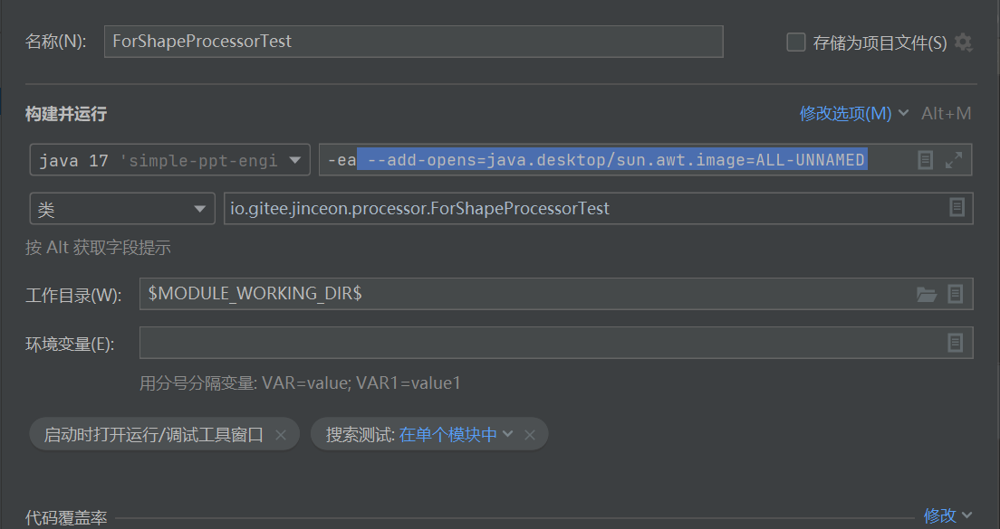

# Frequently Asked Questions 常见问题解答
1. 动态表格报错java.lang.IllegalAccessError: class com.aspose.slides.internal.mg.if (in unnamed module @0x1c2c22f3) cannot access class sun.awt.image.IntegerInterleavedRaster (in module java.desktop) because module java.desktop does not export sun.awt.image to unnamed module @0x1c2c22f3
    >在Java9之后引入了模块化的概念，是将类型和资源封装在模块中，并仅导出其他模块要访问其公共类型的软件包。如果模块中的软件包未导出或打开，则表示模块的设计人员无意在模块外部使用这些软件包。 这样的包可能会被修改或甚至从模块中删除，无需任何通知。 如果仍然使用这些软件包通过使用命令行选项导出或打开它们，可能会面临破坏应用程序的风险！
    
    >因此解决办法可以更换java 8或在启动时加上 --add-opens=java.desktop/sun.awt.image=ALL-UNNAMED

    