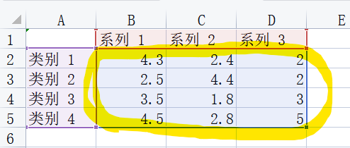
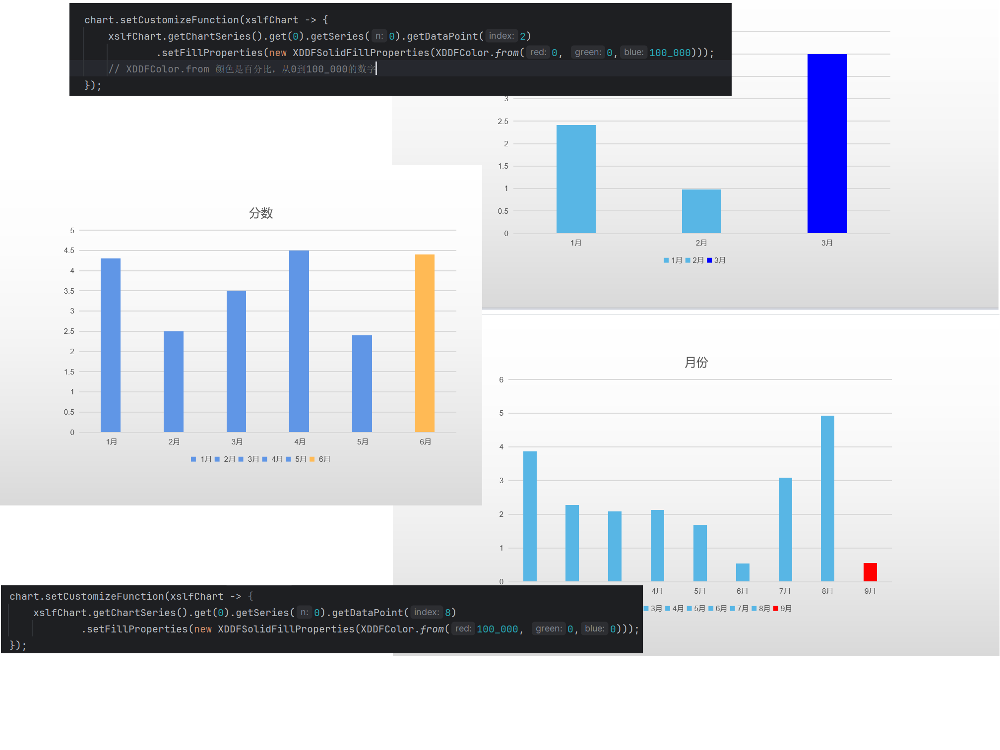

# Chart 图表
## Requirements 前置条件
[Data和UI绑定](../BindData.md)

## Caution 特别注意

`A2:A5`是categories，`B1:D1`是series。  
`B2:D5`才是data部分（上图马克笔标记部分）

调用`setData(List list)`来设置数据的时候，请注意data只应包含数据。  
考虑到java的习惯，我们也提供了`setDataWithCategories(List list, String categoryField)`来方便使用。

## 定制化函数钩子
图表是个非常常用的组件。  
有时也会有一些定制化需求，比如说以年为范围，以月为维度，展示一个条形图。  
那么条形图最少的时候是1月，只有1个柱。  
条形图最多的时候是12月，有12个柱。  
假如要求高亮当前月（以一个不同的颜色表示当前月），即最后一个柱子，在模板上是不好设置的。  
因此增加了一个定制化函数钩子，可以在里面实现一些风格的定制化。  
具体代码可以参见`src/test/java/io/gitee/jinceon/core/data/ChartDataProcessorHookTest.java`

```java
SimpleEngine engine = new SimpleEngine("src/test/resources/chart-hook.pptx");
DataSource dataSource = new DataSource();
Chart chartA = ....();
chartA.setCustomizeFunction(xslfChart -> {
    xslfChart.getChartSeries().get(0).getSeries(0)
        .getDataPoint(8) // 因此示例里是9个月的数据，所有最后一个月下标是8
        .setFillProperties(new XDDFSolidFillProperties(XDDFColor.from(100_000, 0, 0)));
    });
dataSource.setVariable("chartA", chartA);
engine.setDataSource(dataSource);
engine.process();
engine.save("src/test/resources/test-chart-hook.pptx");
```

