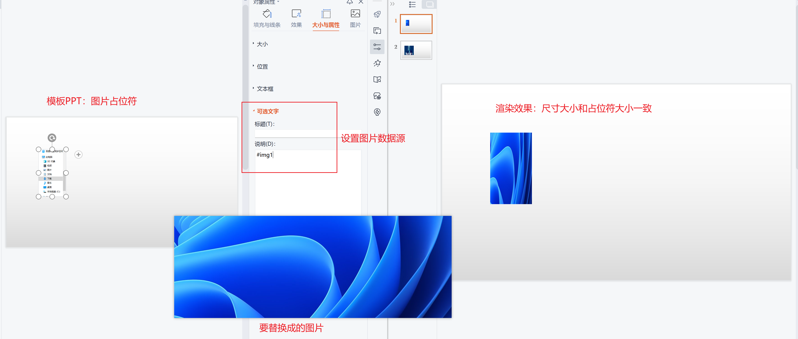
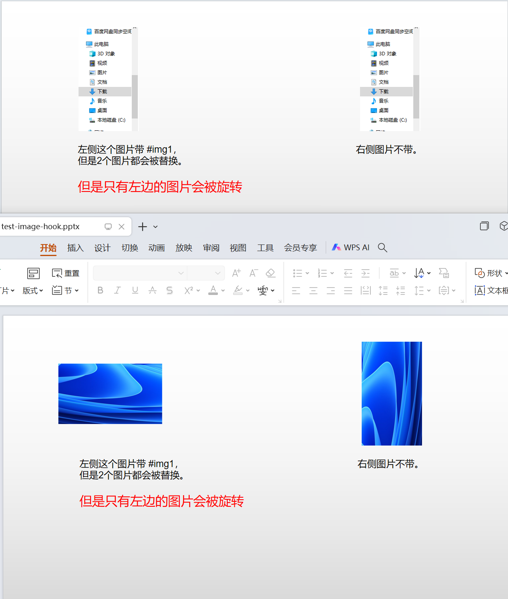

# Image 图片
本引擎对图片的处理比较简单。  
先在ppt模板里随意插入一个图片，将长宽设置为自己需要的大小。  
然后在`可选文字`里设置好图片的数据源即可
(如下图的`#img1`对应Example里的`dataSource.setVariable("img1", png);`)。 


## Example 示例
```java
    SimpleEngine engine = new SimpleEngine("src/test/resources/image.pptx");
    DataSource dataSource = new DataSource();
    byte[] png = Files.readAllBytes(Paths.get("src/test/resources/image.png"));
    byte[] jpg = Files.readAllBytes(Paths.get("src/test/resources/image.jpg"));
    dataSource.setVariable("img1", png);
    dataSource.setVariable("img2", jpg);
    engine.setDataSource(dataSource);
    engine.process();
    String outputFile = "src/test/resources/test-image.pptx";
    engine.save(outputFile);
```
## Tips 提示
对图片的大小未做特殊处理，所以不管你的图片尺寸是怎样的，默认都会被渲染成`展位图`图片的大小。  
如果希望按图片原始尺寸渲染，请参考`定制化函数钩子`。

## 定制化函数钩子
图片是个非常常用的组件。  
如果需要对图片的展示做一些定制化处理，如根据图片的原始尺寸渲染，那么就可以使用定制化函数钩子了。  
具体代码可以参见`src/test/java/io/gitee/jinceon/core/data/ImageDataProcessorHookTest.java`

```java
SimpleEngine engine = new SimpleEngine("src/test/resources/image-hook.pptx");
DataSource dataSource = new DataSource();
byte[] png = Files.readAllBytes(Paths.get("src/test/resources/image.png"));
dataSource.setVariable("img1", new Image(png, xslfPictureShape -> {
    // 图片旋转90°
    xslfPictureShape.setRotation(90.0);
}));


byte[] jpg = Files.readAllBytes(Paths.get("src/test/resources/image.jpg"));
BufferedImage jpg1 = ImageIO.read(new ByteArrayInputStream(png));
int actualWidth = jpg1.getWidth();
int actualHeight = jpg1.getHeight();
dataSource.setVariable("img2", new Image(jpg, xslfPictureShape -> {
    // 忽略占位符尺寸，按图片原始尺寸渲染
    Rectangle2D rectangle2D = xslfPictureShape.getAnchor();
    rectangle2D.setRect(rectangle2D.getX(), rectangle2D.getY(), actualWidth, actualHeight);
    xslfPictureShape.setAnchor(rectangle2D);
}));
engine.setDataSource(dataSource);
engine.process();
String outputFile = "src/test/resources/test-image-hook.pptx";
engine.save(outputFile);
```



## Warning 特别提醒
[请参考Image替换bug](https://gitee.com/jinceon/simple-ppt-engine/issues/I8C7K6)

作为程序员，应该可以理解，如果是相同的图片，ppt底层是存了一份源图片，然后在ppt里引用了2次该图片。
所以会出现，图片替换后，所有引用的地方都发生了变化。

如果要解决，就不能改变原图片，而是重新插入一个新的图片，并将占位图片的位置、尺寸等信息复制过来。
这个代码复杂度就变大了。

从用户（开发人员）体验来说，我同意这是一个bug。  
但是从成本收益来说，我还是**建议，用2个不同的图片来占位。**  
并且这在开发测试阶段就能被发现，不会是一个隐藏的坑。