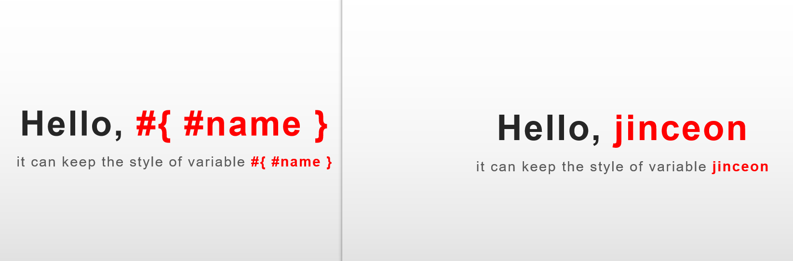
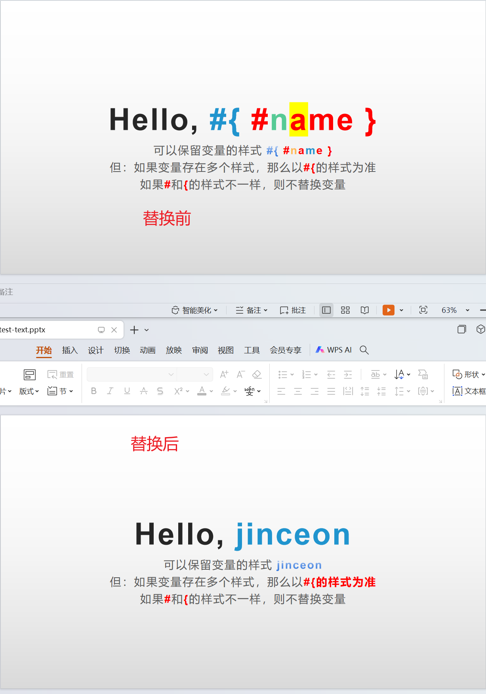
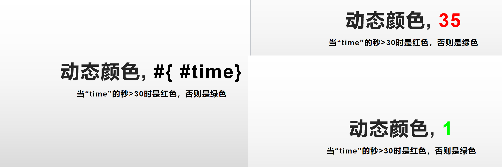

# Text 文本
文本处理是最简单的。  
将需要动态替换的文字用占位符代替即可。  
引擎使用SpEL（Spring Expression Language）来处理占位符的替换。  
假设文本框的内容是`你好, #{ #name }`，当我们给引擎增加一个变量`name=延春`时，文本框的文字最终会被替换成`你好，延春`。

## Example 示例
```java
    SimpleEngine engine = new SimpleEngine("src/test/resources/text.pptx");
    DataSource dataSource = new DataSource();
    dataSource.setVariable("name", "jinceon");
    engine.setDataSource(dataSource);
    engine.process();
    engine.save("src/test/resources/test-text.pptx");
```
## Tips 提示
由于PPT文本框的文字可以设置各种各样的样式，为了保证替换占位符后的文字样式和之前一致，引擎在处理文本的时候需要更精细。  
可能存在几种情况：
- 如果变量存在多个样式，如#{ #name }，那么渲染的时候以`#{`的样式为准。
- `#` 和 `{` 样式不同或两者未连在一起，不替换此变量。
- 只有`#{`而没有`}`，那么`#{`后的内容的样式会变得和`#{`的样式一致。



中英文输入、大小写切换的时候，经常会出现单词被默认切割成2个portion的情况。  
比如模板输入 #{ #nickName } 大概率在调试的时候会发现它被切成`#{ #` 和 `nickName`等等，即使它们样式已经是一样。
遇到这种情况，建议把`#{ #nickName }`这几个字符选中，重新设置一次字体，或者设置下加粗再取消加粗，这样大概率就可以强制将它们合并为一个portion。

## 定制化函数钩子
文本是个非常常用的组件。  
有时也会有一些定制化需求，比如说一个同比增长率，正数显示绿色字体，负数显示红色字体。  
当然也可以在模板上做，设置2个文本框，一个模板红色，一个模板绿色，根据实际数值动态将另外一个置为空字符串，但是这种做法确实太繁琐，也不直观。
因此增加了一个定制化函数钩子，可以在里面实现一些风格的定制化。  
具体代码可以参见`src/test/java/io/gitee/jinceon/core/data/TextDataProcessorHookTest.java`

```java
SimpleEngine engine = new SimpleEngine("src/test/resources/text-hook.pptx");
DataSource dataSource = new DataSource();
int time = LocalTime.now().getSecond();
dataSource.setVariable("time", new Text(time+"", xslfTextRun -> {
   if(time > 30) {
       xslfTextRun.setFontColor(Color.RED);
   }else{
       xslfTextRun.setFontColor(Color.GREEN);
   }
}));

engine.setDataSource(dataSource);
engine.process();
String outputFile = "src/test/resources/test-text-hook.pptx";
engine.save(outputFile);
```

